CAR EDA by Ahmet Hamza Emra
========================================================
Over 370000 used cars scraped with Scrapy from Ebay-Kleinanzeigen. The content of the data is in german, so one has to translate it first if one can not speak german. Those fields are included:

dateCrawled : when this ad was first crawled, all field-values are taken from this date

name : "name" of the car

seller : private or dealer

offerType

price : the price on the ad to sell the car

abtest

vehicleType

yearOfRegistration : at which year the car was first registered

gearbox

powerPS : power of the car in PS

model

kilometer : how many kilometers the car has driven

monthOfRegistration : at which month the car was first registered

fuelType

brand

notRepairedDamage : if the car has a damage which is not repaired yet

dateCreated : the date for which the ad at ebay was created

nrOfPictures : number of pictures in the ad

postalCode

lastSeenOnline : when the crawler saw this ad last online


```
## 'data.frame':	189349 obs. of  20 variables:
##  $ dateCrawled        : Factor w/ 164590 levels "2016-03-05 14:06:22",..: 96234 96080 44613 62122 135465 158918 142369 82743 161561 60299 ...
##  $ name               : Factor w/ 128113 levels "<U+0096>_ein_Kombi_+_4WD__perfekt_fuer_alle_Lebenslagen__",..: 43604 2400 50197 44742 94997 15678 80970 118441 34980 119726 ...
##  $ seller             : Factor w/ 2 levels "gewerblich","privat": 2 2 2 2 2 2 2 2 2 2 ...
##  $ offerType          : Factor w/ 2 levels "Angebot","Gesuch": 1 1 1 1 1 1 1 1 1 1 ...
##  $ price              : int  480 18300 9800 1500 3600 650 2200 0 14500 999 ...
##  $ abtest             : Factor w/ 2 levels "control","test": 2 2 2 2 2 2 2 2 1 2 ...
##  $ vehicleType        : Factor w/ 9 levels "","andere","bus",..: 1 5 9 6 6 8 4 8 3 6 ...
##  $ yearOfRegistration : int  1993 2011 2004 2001 2008 1995 2004 1980 2014 1998 ...
##  $ gearbox            : Factor w/ 3 levels "","automatik",..: 3 3 2 3 3 3 3 3 3 3 ...
##  $ powerPS            : int  0 190 163 75 69 102 109 50 125 101 ...
##  $ model              : Factor w/ 251 levels "","1_reihe","100",..: 119 1 120 119 104 13 9 42 58 119 ...
##  $ kilometer          : int  150000 125000 125000 150000 90000 150000 150000 40000 30000 150000 ...
##  $ monthOfRegistration: int  0 5 8 6 7 10 8 7 8 0 ...
##  $ fuelType           : Factor w/ 8 levels "","andere","benzin",..: 3 5 5 3 5 3 3 3 3 1 ...
##  $ brand              : Factor w/ 40 levels "alfa_romeo","audi",..: 39 2 15 39 32 3 26 39 11 39 ...
##  $ notRepairedDamage  : Factor w/ 3 levels "","ja","nein": 1 2 1 3 3 2 3 3 1 1 ...
##  $ dateCreated        : Factor w/ 97 levels "2014-03-10 00:00:00",..: 83 83 73 76 90 94 91 80 94 76 ...
##  $ nrOfPictures       : int  0 0 0 0 0 0 0 0 0 0 ...
##  $ postalCode         : int  70435 66954 90480 91074 60437 33775 67112 19348 94505 27472 ...
##  $ lastSeen           : Factor w/ 111190 levels "2016-03-05 14:15:08",..: 107390 106918 92424 25353 100813 104198 94797 50176 88971 71117 ...
```


## Formating the data


```
##      price              vehicleType    yearOfRegistration
##  Min.   :       0   limousine :48664   Min.   :1000      
##  1st Qu.:    1150   kleinwagen:40740   1st Qu.:1999      
##  Median :    2950   kombi     :34464   Median :2003      
##  Mean   :   10895             :19421   Mean   :2005      
##  3rd Qu.:    7200   bus       :15520   3rd Qu.:2008      
##  Max.   :99999999   cabrio    :11662   Max.   :9999      
##                     (Other)   :18738                     
##       gearbox          powerPS          model          kilometer     
##           : 10384   Min.   :  0.0   golf   : 15276   Min.   :  5000  
##  automatik: 39191   1st Qu.: 70.0   andere : 13447   1st Qu.:125000  
##  manuell  :139634   Median :105.0   3er    : 10518   Median :150000  
##                     Mean   :112.1          : 10382   Mean   :125639  
##                     3rd Qu.:150.0   polo   :  6709   3rd Qu.:150000  
##                     Max.   :999.0   corsa  :  6410   Max.   :150000  
##                                     (Other):126467                   
##     fuelType                brand      
##  benzin :114031   volkswagen   :40650  
##  diesel : 54936   bmw          :20525  
##         : 16907   opel         :20409  
##  lpg    :  2731   mercedes_benz:17918  
##  cng    :   306   audi         :16668  
##  hybrid :   142   ford         :13085  
##  (Other):   156   (Other)      :59954
```


# Univariate Plots Section


## Price 


```
##     Min.  1st Qu.   Median     Mean  3rd Qu.     Max. 
## 0.00e+00 1.15e+03 2.95e+03 1.09e+04 7.20e+03 1.00e+08
```


<p>
as we can see there are a lot of outliers for example, there should not be any car for free and also the upper band is very high. So we need to clean some data.
<p/>


```
##    Min. 1st Qu.  Median    Mean 3rd Qu.    Max. 
##     209    1299    2990    4611    6559   19790
```


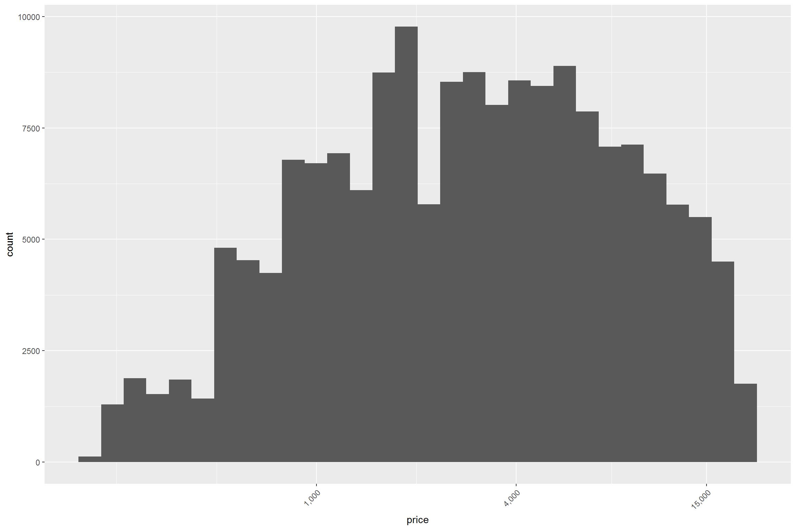

## Year of Registration


```
##    Min. 1st Qu.  Median    Mean 3rd Qu.    Max. 
##    1000    1999    2003    2004    2008    9999
```
also for this column max date can not be after 2016. this is which year data from. also first car ivented at 1885 (whick is still to less but), so there cannot be any thing before that year.


after cleaning process:

```
##    Min. 1st Qu.  Median    Mean 3rd Qu.    Max. 
##    1951    1999    2003    2002    2007    2015
```
lets create the histograms:


```
##                andere        bus     cabrio      coupe kleinwagen 
##       4623       1502      14394       9945       7707      38039 
##      kombi  limousine        suv 
##      32015      44531       5804
```


I think it is stange that there are more limusine than the other kind of cars.


## Brand


```
##     alfa_romeo           audi            bmw      chevrolet       chrysler 
##           1041          13541          17136            814            649 
##        citroen          dacia         daewoo       daihatsu           fiat 
##           2296            431            233            327           4204 
##           ford          honda        hyundai         jaguar           jeep 
##          11006           1234           1637            223            305 
##            kia           lada         lancia     land_rover          mazda 
##           1124             89            200            265           2550 
##  mercedes_benz           mini     mitsubishi         nissan           opel 
##          14819           1493           1296           2198          17152 
##        peugeot        porsche        renault          rover           saab 
##           5113            352           7696            208            240 
##           seat          skoda          smart sonstige_autos         subaru 
##           3008           2658           2541           1178            333 
##         suzuki         toyota        trabant     volkswagen          volvo 
##           1059           2172            211          34009           1519
```


volkswagen looks like the most popular car in the market. lets check which kind of volkswagens are in market.

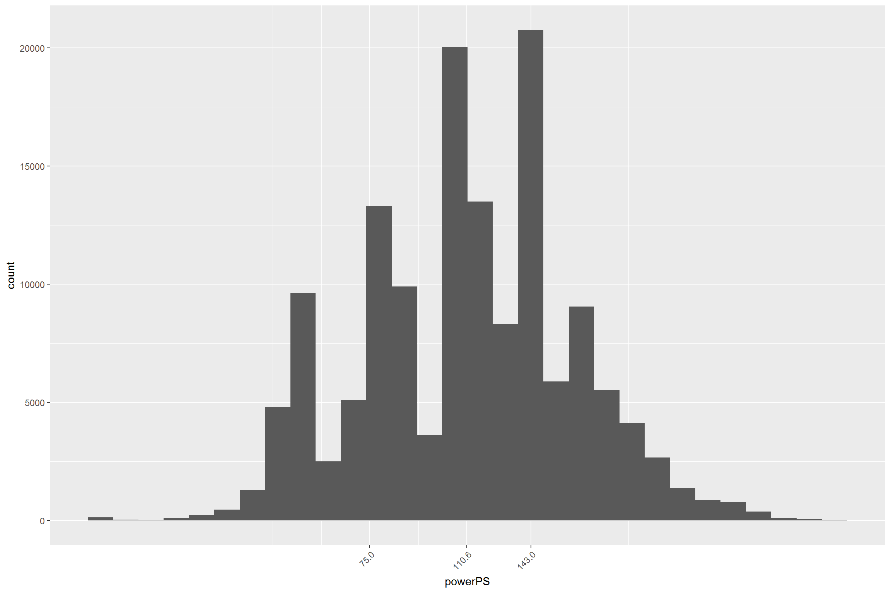

## gear box


```
##           automatik   manuell 
##      6436     30920    121204
```
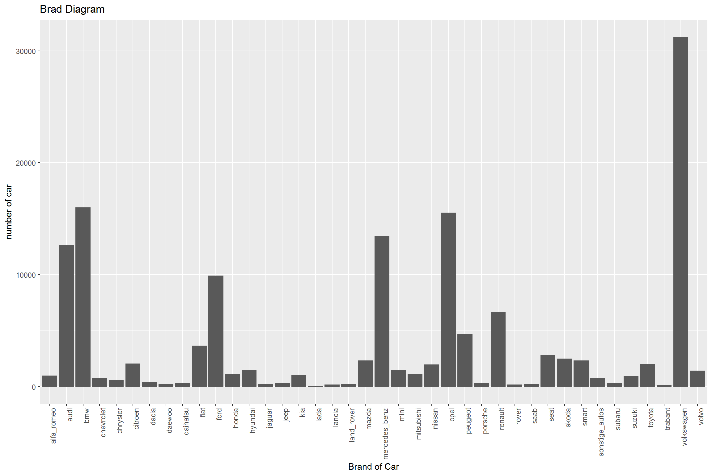


## kilometer


```
##    Min. 1st Qu.  Median    Mean 3rd Qu.    Max. 
##    5000  125000  150000  128300  150000  150000
```
<p> 

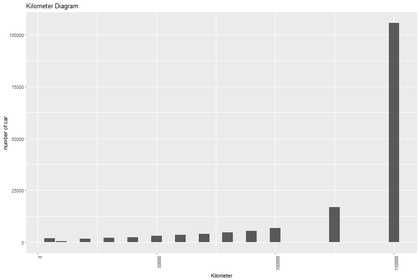


## Fueltype


```
##          andere  benzin     cng  diesel elektro  hybrid     lpg 
##    9252      75   99085     277   47236      33     110    2492
```
<br />
there are a lot of missing data in this column so we need to use subset 
<br />


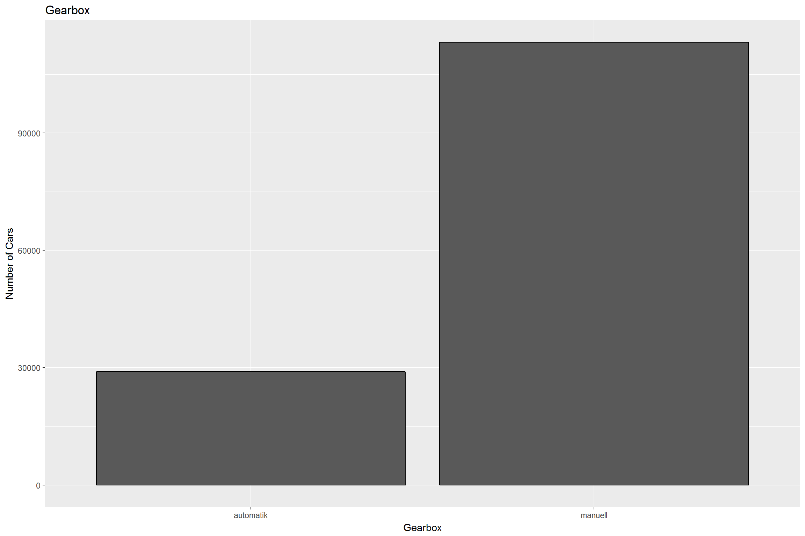

```
## $x
## [1] "Kilometer"
## 
## $y
## [1] "number of car"
## 
## $title
## [1] "Kilometer Diagram"
## 
## attr(,"class")
## [1] "labels"
```
<br />
from this table we can understand that the most comman ones. but it is hard to talk about types other thab benzin, diesel and lpg. 


# Bivariate Plots Section

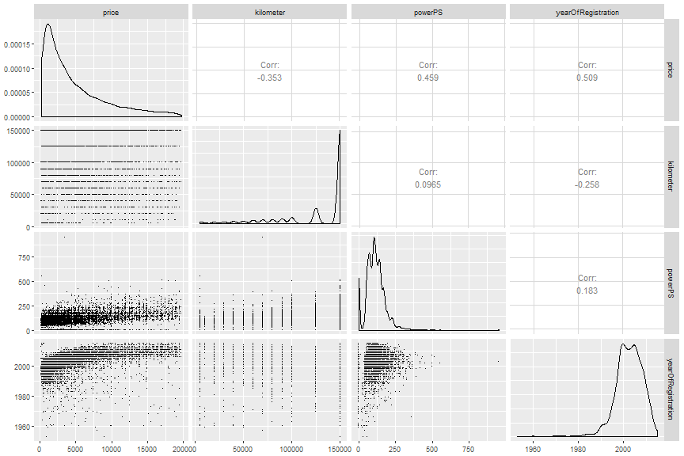


as we can see form the table, the corrolation between powerPS and Price is stronger than others. and also there is prity good corrolation number between price and kilometer


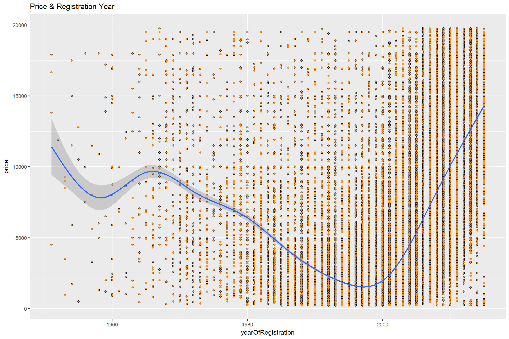


I was expecting that new cars would have the high price but some of the cars even they are quite antique still have high price. those might be special cars such as classics. 

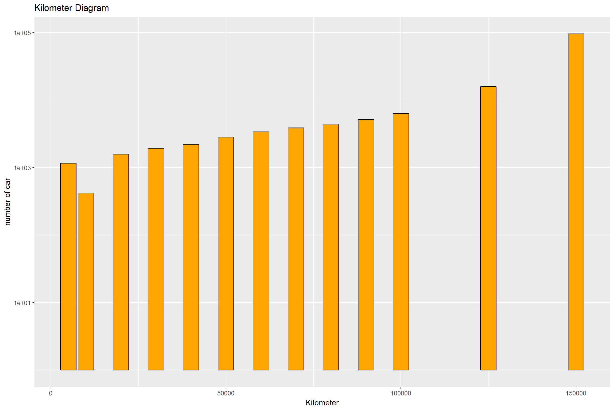


the relationship between this are very clear as expected. cars with high horse power are most of the time expensive cars. 


I was expecting that when the kilometer is low, pice would be high. but again some cars behave differently. and again those car might be classics. to understand this situation we need to add another veriable. 

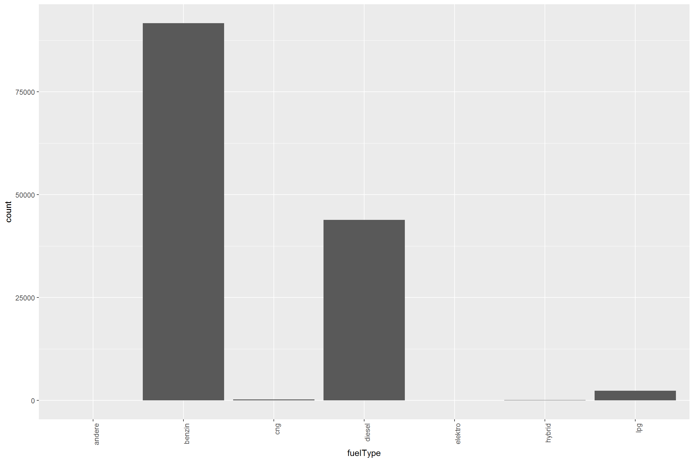


We observe that SUV is the most expensive vehicle type while kleinwagen is the cheapest. However, kleinwagen have many outliers which may signify either user error or specific higher end brand and model combination.


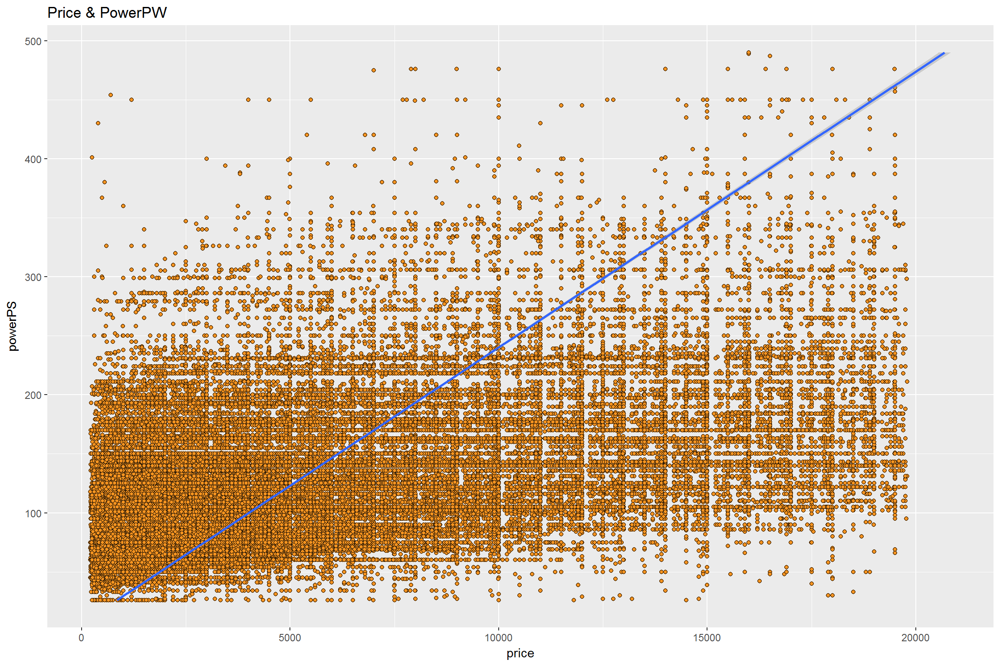
There is linear correlation between engine power (PowerPS) and price in each vehicle type but after 150 powerPS it is possible to observe non-linarites.


# Multivariate Plots Section

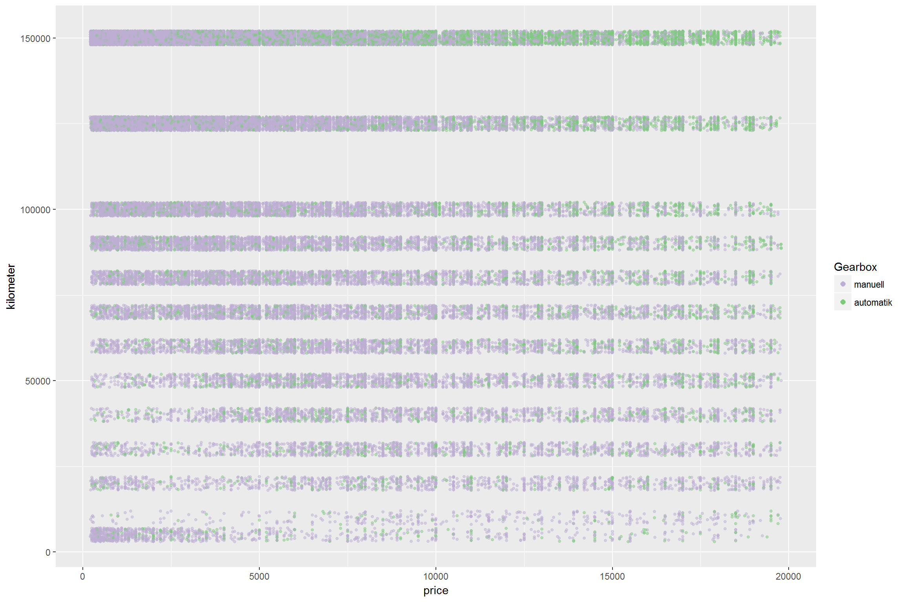


  
as we can see in lower costs purple is more intense. So manuel cars are more likely to be cheaper. but for range (2500 to 5000) outomatic cars has the lead. but after arout 50000 the both gearbox type has same behavior.


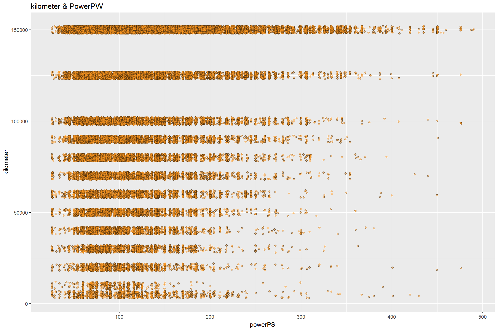


    
kleinwagen model cars are small and has small engine. so that It is not a suprise that they are cheap. also the andre is german word for other. So there is a lot of car models can be in that category. it is hard to trust that line since we dont know what kind a car it is. 

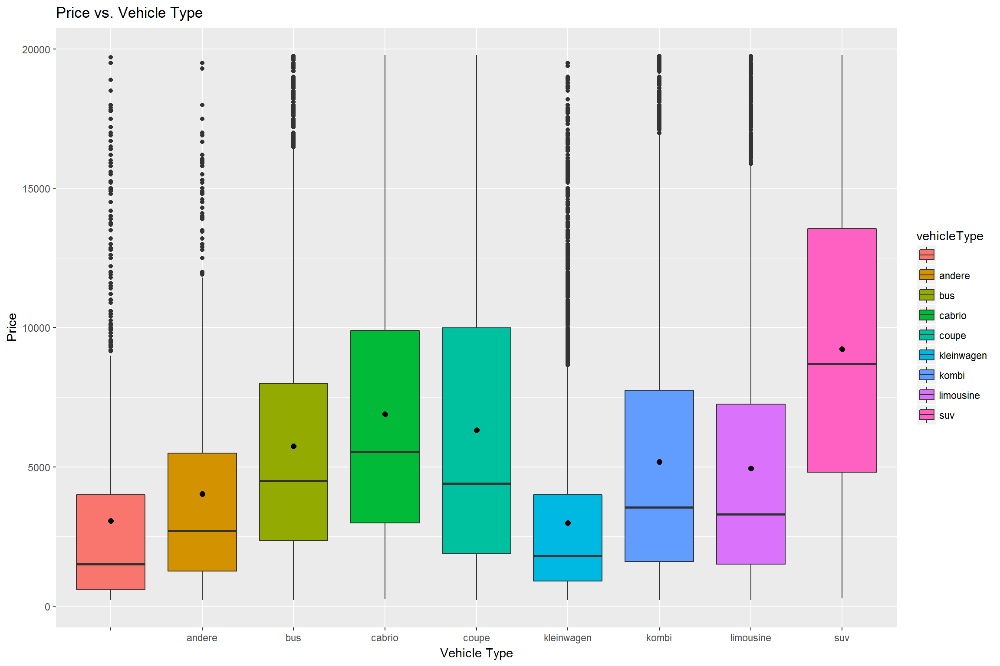

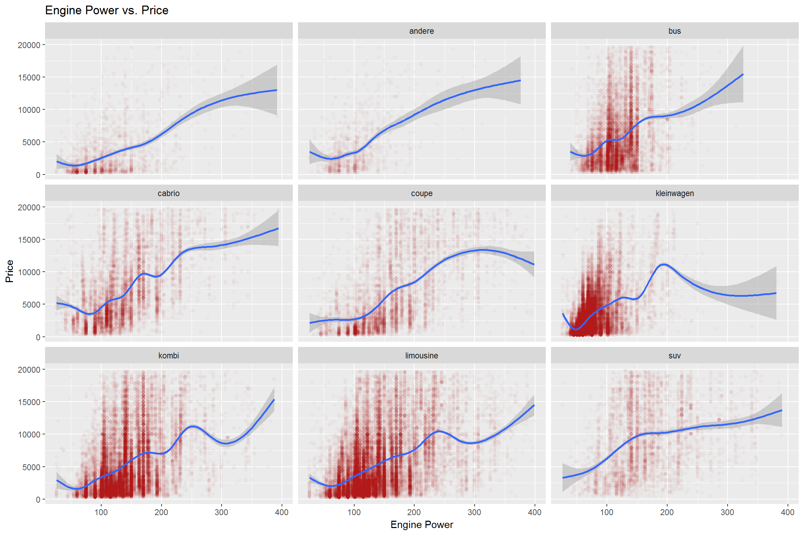

# Multivariate Analysis

### Talk about some of the relationships you observed in this part of the investigation. Were there features that strengthened each other in terms of looking at your feature(s) of interest?

I commend them under the plots. 

### Were there any interesting or surprising interactions between features?
Since benzin is expencive in europe, i was expecting disel cars to be cheper. but for same kilometer almost allways diesel is expensive. 

------

# Final Plots and Summary

## Plot One

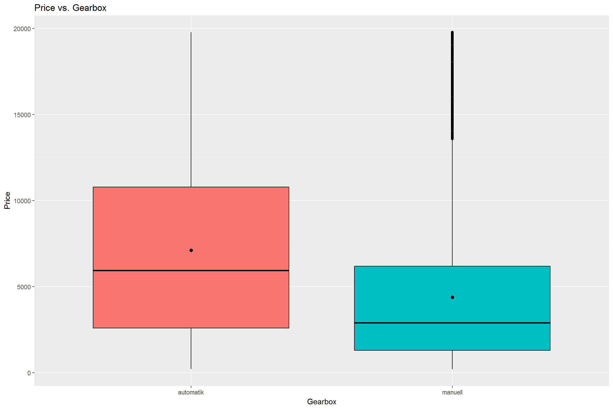

### Description One
We observe that SUV is the most expensive vehicle type while kleinwagen is the cheapest. However, kleinwagen have many outliers which may signify either user error or specific higher end brand and model combination.


## Plot Two
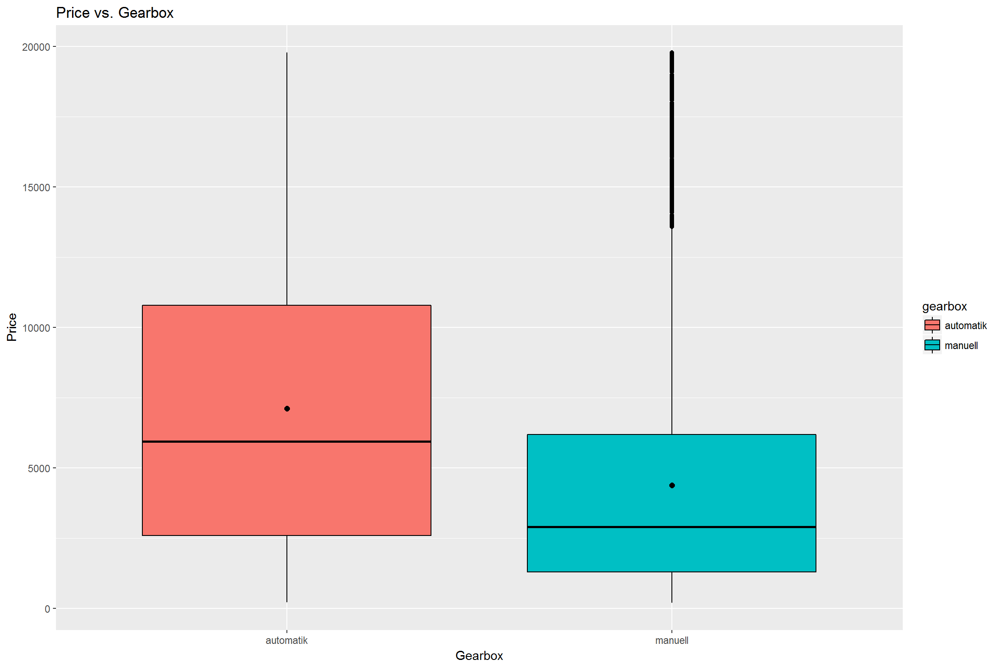

### Description Two

There is linear correlation between engine power (PowerPS) and price in each vehicle type but after 150 powerPS it is possible to observe non-linarites.

## Plot tree


### Description Three

As expected, the second-hand cars with automatic gearbox are more expensive than manual ones.


------

# Reflection

Limousine, kombi and kleinwagen are the most popular vehicle types in the second-hand market. Most expensive cars are SUV's while the cheapest ones are kleinwagens.
On average Kleinwagen vehicle type is the cheapest and has the lowest engine power. But it also shows the most outliers - might be as a result of brand-model diversity.
The most popular brands are Volkswagen, BMW, Opel, Mercedes, Audi, Ford, Renault, Peugeot, Fiat and Seat. These 10 brand correspond to almost 80% of the cars. (Originally our dataset contains around 40 brands)
According to our regression analysis, age (39%), kilometer(%23) and engine power(%19) are the most important factors explaining second hand price.
Most of the cars in the second-hand market are above 100.000 km, even 150.000 km. People does not frequently change cars according to our data set.
Majority of the second-hand cars are sold only within 35 days. The ratio of the first 10 days (day 0 stands for same day sale) is quite high. This shows us that either Ebay-Kleinanzeigen is very successful at targeting customers or the second-hand market is more fluid that we actually thought.
To our surprise, there is no strong/significant correlation between selling time and vehicle type, kilometer and price. We saw that whenever price goes up the change to be sold in 10-20 days increases especially in SUV vehicles (rather than 0-10 days) but this is not a general trend.
Hybrid (electro engine, CNG) second-hand car market is emerging but shows longer selling time trend.
